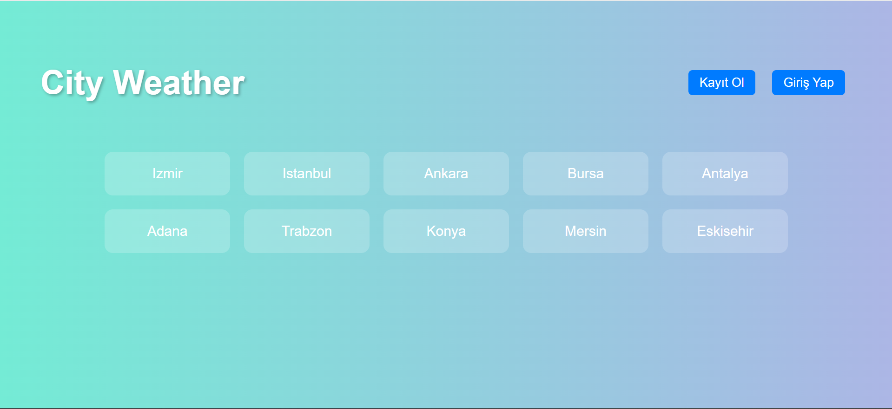

# City Weather Web Uygulaması

## Proje | PYTHON & Django

### Proje Açıklaması

City Weather, kullanıcıların Türkiye’deki şehirlerin hava durumlarını görebileceği ve hızlı bir şekilde şehirlere ulaşabileceği bir Django tabanlı web uygulamasıdır.Uygulama, basit ama modern bir arayüze sahiptir ve kullanıcı dostudur.

---

## Giriş / Kayıt Ekranı

Kullanıcı adı ve şifrenizi girerek sisteme giriş yapabilirsiniz.Kayıtlı değilseniz kullanıcı adı ve şifre yazarak kayıt olabilirsiniz.

---

## Anasayfa

Kullanıcı adı ve şifrenizi girerek sisteme giriş yapabilirsiniz.Tüm şehirlerin listelendiği merkezi sayfa.Şehirler yan yana gösterilir.

---

## Şehir Detay Sayfası

Seçilen şehrin sıcaklığı ve hava durumu bilgileri gösterilir.Hava durumu bilgileri güncel olarak simge ve yazıyla gösterilir.

